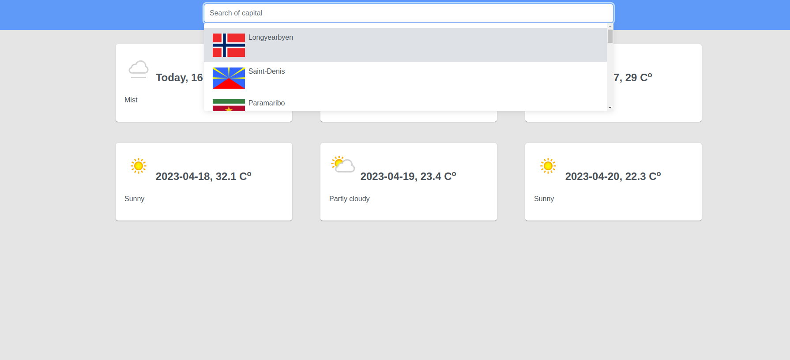
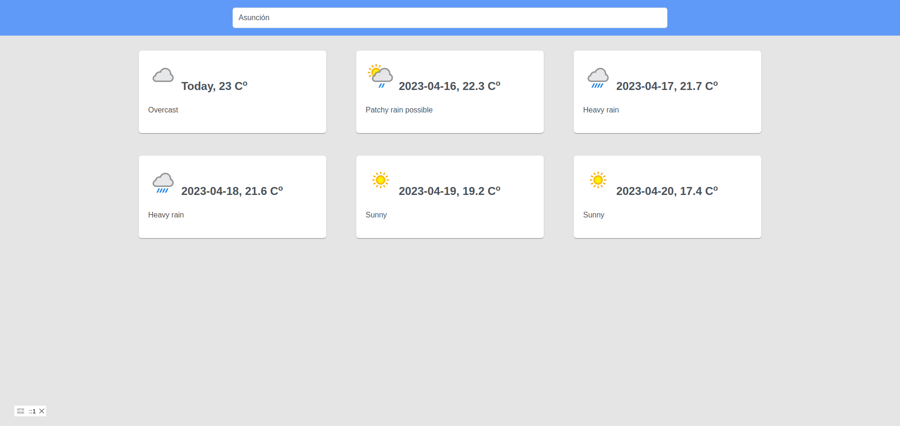
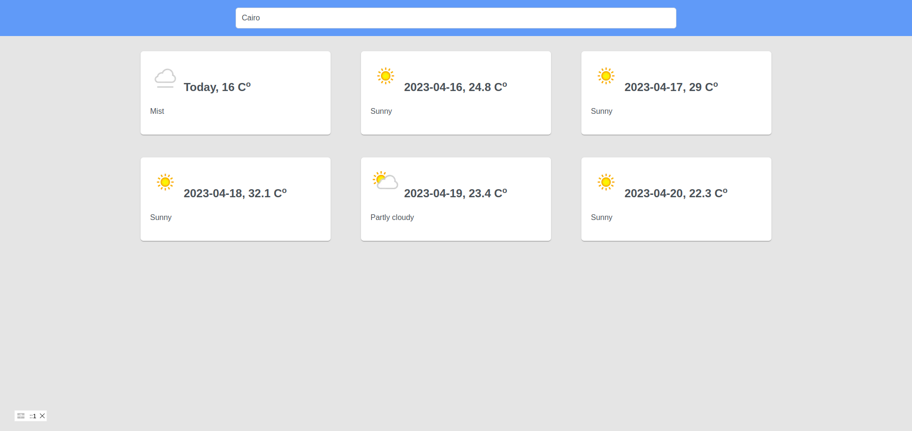

# weather-app


## Project Setup

```sh
npm i
```

### Compile and Hot-Reload for Development

```sh
npm run dev
```

### Compile and Minify for Production

```sh
npm run build
```

### Lint with [ESLint](https://eslint.org/)

```sh
npm run lint
```

## Screenshots
- 
- 
- 
- 
- 